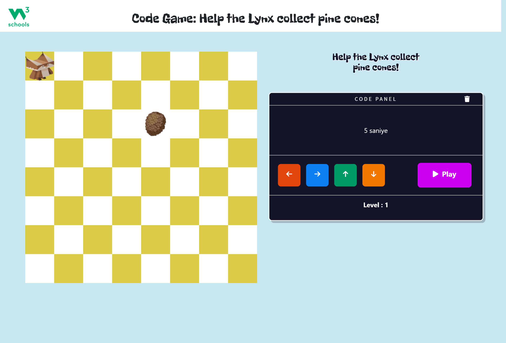

# 🎮 W3 Game

W3 Game is a simple, browser-based interactive game built using HTML, CSS, and JavaScript. The project showcases fundamental front-end development skills and JavaScript DOM manipulation.

## 🕹️ Game Features

- Interactive gameplay with real-time feedback  
- Score tracking system  
- Dynamic UI updates with JavaScript  
- Responsive design for desktop and mobile

## 🔧 Technologies Used

- **HTML5** – for the basic structure  
- **CSS3** – for layout and styling  
- **JavaScript** – for game logic and interactivity  

## 📸 Screenshots

### Game Screen  



## 📁 How to Run the Project

1. Clone the repository:
   ```bash
   git clone https://github.com/beyzakblt/w3-game.git
   cd w3-game
   ```

2. Open `index.html` in your web browser.

No installation or setup needed — it's fully client-side!

## 🙋‍♀️ Developer

**Beyza Akbulut**  
📧 beyzakblt@gmail.com  
🔗 [LinkedIn](https://www.linkedin.com/in/beyzakbulut)  
💻 [GitHub](https://github.com/beyzakblt)
